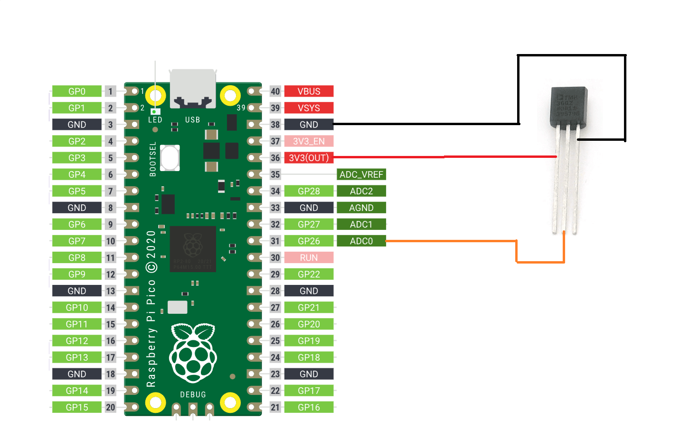

# Simple IoT Project
### Описание проекта на русском смотри ниже [↓](#%D0%BF%D1%80%D0%BE%D1%81%D1%82%D0%BE%D0%B9-%D0%BF%D1%80%D0%BE%D0%B5%D0%BA%D1%82-%D0%B8%D0%BD%D1%82%D0%B5%D1%80%D0%BD%D0%B5%D1%82%D0%B0-%D0%B2%D0%B5%D1%89%D0%B5%D0%B9)

The project is a simple **IoT** project that uses a *Raspberry Pi Pico W* and a *TMP36* sensor to measure temperature (Video Tutorial on TMP36 sensor can be found [here](https://youtu.be/y_RuKoYqlJ4?si=VVFExP5LfA2FrHx7)).

The data is displayed on a webpage using simple html text and some inline css. The webpage is hosted on the Pico W and can be accessed by any device on the same network as the Pico W. The project also includes a simple button that allows the user to turn ON and OFF an onboard LED on the Pico W. The code uses MicroPython and the network and socket modules to create a simple web server on the Pico W. The server listens for incoming requests and sends the webpage to the client (device with a web browser). The network module is used to connect the Pico W to the local network and the socket module is used to create a socket object that allows the Pico W to accept connections from any client.

### Hardware
- Raspberry Pi Pico W
- TMP36 Temperature Sensor
- Breadboard
- Jumper Wires

### Software
- Thonny IDE
- MicroPython
- network module
- socket module

### Circuit Diagram

### Code
[main.py](main.py)

---

# Простой проект Интернета вещей

Этот проект представляет собой простой проект **Интернета Вещей**, в котором используются *Raspberry Pi Pico W* и датчик *TMP36* (видеоурок по датчику TMP36 можно найти [здесь](https://youtu.be/mOo-aEDJHo4?si=ZE_BtfRVM53txhia)

Данные отображаются на веб-странице с использованием простого текста HTML и некоторого встроенного CSS. Веб-страница хостица на Pico W, и доступ к ней может получить любое устройство в той же сети, что и Pico W. Проект также включает в себя простую кнопку, которая позволяет пользователю включать и выключать встроенный светодиод на Pico W. Код использует MicroPython, а также модули сети (network) и сокетов (sockets) для создания простого веб-сервера на Pico W. Сервер прослушивает входящие запросы и отправляет веб-страницу клиенту (устройство с веб-браузером). network модуль используется для подключения Pico W к локальной сети, а модуль sockets используется для создания объекта сокета, который позволяет Pico W принимать соединения от любого клиента.

### Что требуется
- Raspberry Pi Pico W
- Датчик температуры TMP36
- Макетная плата
- Провода

### Программное обеспечение
- Thonny IDE
- MicroPython
- network модуль
- socket модуль

### Принципиальная схема

### Код
[main.py](main.py)
